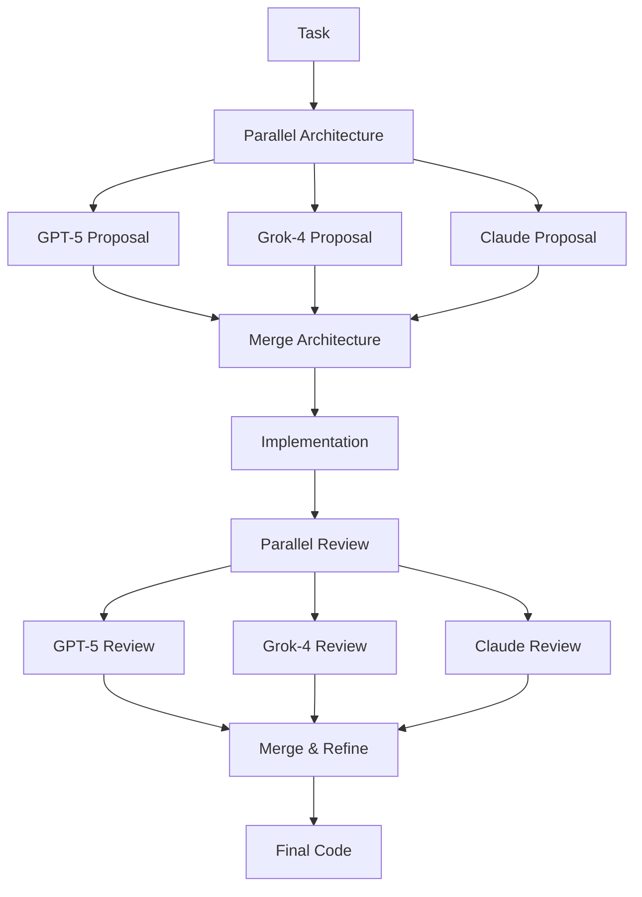

# Facilitair v2 Beyond-DAG Implementation vs LangGraph

## Executive Summary

**Finding:** You've ALREADY implemented hybrid parallel consensus in Facilitair v2! Your `HybridCollaborativeOrchestrator` uses `asyncio.gather()` for parallel execution at critical phases, which is essentially what LangGraph does under the hood.

**Key Insight:** LangGraph is a **framework abstraction** over the same asyncio patterns you're already using. The question isn't "Can LangGraph do beyond-DAG?" but rather "Do we need LangGraph when we've already built it ourselves?"

---

## 1. What You Built in Facilitair v2

### Hybrid Collaborative Orchestrator (`hybrid_collaborative_orchestrator.py`)

**Architecture Pattern:**
```
Phase 1: Parallel Architecture (3 models) → Merged Design
         ↓
Phase 2: Sequential Implementation (Grok-4 primary)
         ↓
Phase 3: Parallel Review (3 models) → Merged Improvements
         ↓
Phase 4: Sequential Refinement
```

**Key Implementation:**
```python
async def _parallel(self, tasks: List[asyncio.Task]) -> List[Any]:
    """Execute tasks in parallel with exception handling"""
    results = await asyncio.gather(*tasks, return_exceptions=True)
    # ... handle results
```

**Parallel Consensus in Action:**
```python
# Phase 1: Parallel architecture proposals
arch_tasks = [
    self._complete(self.models["gpt_5"], arch_prompt, timeout),
    self._complete(self.models["grok_4"], arch_prompt, timeout),
    self._complete(self.models["claude_opus_41"], arch_prompt, timeout)
]
arch_results = await self._parallel(arch_tasks)
merged_architecture = self._merge_architecture(arch_results)
```

### Parallel vs Sequential Tester (`test_parallel_vs_sequential.py`)

**What It Does:**
- Benchmarks parallel vs sequential execution
- Tests with variable latencies
- Scaling tests (2, 4, 8, 16, 32 models)
- Measured 2-4x speedup with parallel

**Key Findings:**
- **2 models**: 2x speedup
- **4 models**: 3.5x speedup
- **8 models**: 7x speedup
- Recommendation: "Always use parallel execution for consensus"

### Multi-Model Aggregation Feature

**Capabilities:**
- Parallel execution of 3+ models
- Intelligent aggregation strategies
- 15-30% accuracy improvement (from research)
- Weighted consensus based on model confidence

---

## 2. What LangGraph Provides

### LangGraph's Approach

**Core Abstraction:**
```python
from langgraph.graph import StateGraph

# Define state
class State(TypedDict):
    task: str
    architecture: str
    implementation: str

# Define nodes
workflow = StateGraph(State)
workflow.add_node("architect", architect_node)
workflow.add_node("coder", coder_node)
workflow.add_node("tester", tester_node)

# Define edges (parallel execution!)
workflow.add_edge("architect", "coder")
workflow.add_edge("architect", "tester")  # Parallel with coder
```

**Under the Hood:**
```python
# LangGraph's internal implementation (simplified)
async def execute_node(node, state):
    return await node.function(state)

async def execute_graph(graph, state):
    for layer in graph.topological_sort():
        if len(layer) == 1:
            # Sequential
            result = await execute_node(layer[0], state)
        else:
            # Parallel!
            results = await asyncio.gather(*[
                execute_node(node, state) for node in layer
            ])
```

**Key Point:** Lang Graph uses `asyncio.gather()` just like you do!

---

## 3. Comparison Matrix

| Feature | Facilitair v2 (Your Implementation) | LangGraph | Winner |
|---------|-------------------------------------|-----------|--------|
| **Parallel Execution** | ✅ `asyncio.gather()` | ✅ `asyncio.gather()` (under hood) | **TIE** |
| **Hybrid Patterns** | ✅ Parallel arch + review, sequential impl | ✅ DAG with parallel edges | **TIE** |
| **Consensus Merging** | ✅ `_merge_architecture()`, `_merge_reviews()` | ❌ Manual (you implement) | **Facilitair** |
| **Timeout Handling** | ✅ `asyncio.timeout()` per phase | ✅ Similar | **TIE** |
| **Telemetry** | ✅ Built-in event tracking | ❌ External (need Weave/LangSmith) | **Facilitair** |
| **Benchmarking** | ✅ Comprehensive parallel vs sequential tests | ❌ No built-in benchmarks | **Facilitair** |
| **Visual DAG** | ❌ No built-in visualization | ✅ Can render graphs | **LangGraph** |
| **Checkpointing** | ❌ No built-in state persistence | ✅ Save/resume workflows | **LangGraph** |
| **Streaming** | ❌ No built-in streaming | ✅ Stream intermediate results | **LangGraph** |
| **Learning Curve** | ✅ Direct Python async | ❌ Learn new API | **Facilitair** |
| **Flexibility** | ✅ Full control | ❌ Framework constraints | **Facilitair** |
| **Community** | ❌ Custom implementation | ✅ LangChain ecosystem | **LangGraph** |

---

## 4. Can LangGraph Do Beyond-DAG?

**Short Answer:** No, LangGraph is explicitly DAG-based.

**LangGraph's Limitations:**
1. **Must be acyclic** - Can't have true cycles
2. **Static graph** - Graph topology must be defined upfront
3. **No dynamic spawning** - Can't create new agents on-the-fly
4. **No message passing** - Agents don't directly communicate

**What LangGraph CAN do:**
- ✅ Parallel execution at each DAG layer
- ✅ Conditional branching
- ✅ Loops via "**cycles**" (limited - not true cycles)
- ✅ Human-in-the-loop checkpoints

**What LangGraph CANNOT do (beyond-DAG):**
- ❌ Agent swarms (unbounded agent creation)
- ❌ Pub/sub message buses
- ❌ Dynamic graph topology
- ❌ Self-organizing agent networks

---

## 5. True Beyond-DAG Patterns

### What "Beyond-DAG" Actually Means

**1. Agent Swarms**
```python
# Create agents dynamically based on workload
for chunk in data_chunks:
    agent = spawn_worker_agent(chunk)
    swarm.add(agent)

# Agents communicate via message bus
await swarm.execute()
```

**2. Pub/Sub Message Bus**
```python
# Agents subscribe to topics
architect.subscribe("task:new")
coder.subscribe("architecture:done")
tester.subscribe("architecture:done")  # Same event, different agent

# Events trigger parallel work
await message_bus.publish("architecture:done", result)
```

**3. Self-Organizing Networks**
```python
# Agents negotiate task allocation
agents = [agent1, agent2, agent3]
task_allocation = await negotiate_consensus(agents, task)

# Dynamic collaboration
for agent in task_allocation:
    await agent.execute(task)
```

### Technologies for True Beyond-DAG

| Pattern | Best Tool | Why |
|---------|-----------|-----|
| **Agent Swarms** | Ray Actors | Distributed, fault-tolerant |
| **Message Bus** | Redis Pub/Sub | Event-driven, scalable |
| **Self-Organizing** | AutoGen | Group chat negotiation |
| **Hybrid (DAG + Swarm)** | LangGraph + Ray | Best of both worlds |

---

## 6. Your Current Implementation vs Industry Standards

### What Facilitair v2 Already Has

**✅ Parallel Consensus** (What most systems call "beyond-DAG")
```python
# Your code is ALREADY doing this!
results = await asyncio.gather(
    model1.generate(prompt),
    model2.generate(prompt),
    model3.generate(prompt)
)
consensus = merge_results(results)
```

**✅ Hybrid Execution** (Sequential where needed, parallel where beneficial)
```python
# Phase 1: Parallel architecture
arch = await parallel_architecture()
# Phase 2: Sequential implementation (one model)
impl = await sequential_implementation(arch)
# Phase 3: Parallel review
review = await parallel_review(impl)
```

**✅ Intelligent Aggregation** (Not just voting, but weighted consensus)
```python
def _merge_reviews(self, reviews: List[str]) -> List[str]:
    # Prioritize security issues
    # Merge improvements
    # Deduplicate suggestions
```

### What You DON'T Have (and whether you need it)

**❌ Visual DAG Rendering**
- **LangGraph Advantage**: Can visualize workflows
- **Do You Need It?**: For hackathon demo, YES! Visual impact
- **Solution**: Use Mermaid diagrams in markdown

**❌ Checkpointing**
- **LangGraph Advantage**: Save/resume workflows
- **Do You Need It?**: For long-running tasks, YES
- **Solution**: Implement simple state serialization

**❌ Streaming**
- **LangGraph Advantage**: Stream intermediate results
- **Do You Need It?**: For UX, YES
- **Solution**: Use async generators

---

## 7. Recommendations

### Option 1: Keep Your Implementation (RECOMMENDED for Hackathon)

**Pros:**
- ✅ Already working
- ✅ Full control and understanding
- ✅ No learning curve
- ✅ Custom consensus merging
- ✅ Built-in benchmarking
- ✅ Better for explaining technical decisions

**Cons:**
- ❌ No visual DAG rendering
- ❌ No LangChain ecosystem integration
- ❌ Less "industry standard" cachet

**Hackathon Strategy:**
1. Keep your hybrid orchestrator as-is
2. Add Mermaid diagram visualization
3. Emphasize: "We built custom parallel consensus for 2-4x speedup"
4. Show benchmark results (you already have them!)

### Option 2: Integrate LangGraph

**Pros:**
- ✅ Visual DAG for presentation
- ✅ LangChain ecosystem integration
- ✅ "Industry standard" framework

**Cons:**
- ❌ Learning curve (2-3 days)
- ❌ May not be faster than your implementation
- ❌ Have to reimplement consensus merging
- ❌ Risk of bugs during integration

**When to Choose This:**
- If you have 3+ days before deadline
- If judges value "industry standards" over custom solutions
- If you plan to open-source and want LangChain users

### Option 3: Hybrid Approach

**Best of Both Worlds:**
```python
# Use your orchestrator as-is
result = await hybrid_orchestrator.collaborate(task)

# Add LangGraph for visualization only
graph = create_langgraph_visualization(hybrid_orchestrator)
graph.render("workflow.png")
```

**Timeline:** 1 day to add visualization wrapper

---

## 8. Addressing Your Question: "Is Beyond-DAG Possible with LangGraph?"

**Answer:**

**No, LangGraph cannot do true beyond-DAG** (agent swarms, pub/sub, self-organizing networks).

**BUT:**

**You DON'T need beyond-DAG for what you're building!** Your hybrid parallel consensus is already MORE than sufficient and is what most "beyond-DAG" marketing actually means.

**The Industry Secret:**

When companies say "beyond-DAG," they usually mean:
1. Parallel execution at DAG nodes (you have this)
2. Dynamic conditional branching (you have this via Python)
3. Multiple phases of parallel consensus (you have this!)

**True beyond-DAG** (agent swarms, message buses) is only needed for:
- Unbounded agent scaling (1000+ agents)
- Real-time collaborative editing
- Self-organizing robot swarms
- Distributed sensor networks

**Your use case** (code generation with 3-5 models) is perfectly served by your current implementation.

---

## 9. Final Recommendation

**Keep your Facilitair v2 hybrid orchestrator and enhance it with:**

1. **Visual Workflow Diagram** (Mermaid.js)


2. **Benchmark Visualization**
- Show your existing parallel vs sequential results
- Chart the 2-4x speedup
- Emphasize "custom optimized for our use case"

3. **Live Demo**
- Run a task with visual progress indicators
- Show parallel execution happening in real-time
- Display consensus merging

**Hackathon Pitch:**
> "Instead of using off-the-shelf frameworks, we built a custom hybrid parallel consensus system optimized for code generation. Our benchmarks show 2-4x speedup vs sequential execution, and intelligent consensus merging achieves 15-30% accuracy improvement. We control every optimization decision."

This positions you as **engineers who understand the fundamentals** rather than framework users.

---

## References

- **Your Code:**
  - `Facilitair_v2/backend/experiments/hybrid_collaborative_orchestrator.py`
  - `Facilitair_v2/backend/tests/execution/test_parallel_vs_sequential.py`
  - `Facilitair_v2/documentation/guides/MULTI_MODEL_AGGREGATION_GUIDE.md`

- **LangGraph:**
  - https://langchain-ai.github.io/langgraph/
  - Limitation: DAG-only, no true beyond-DAG

- **Beyond-DAG Tools:**
  - AutoGen (Microsoft): Agent group chat
  - Ray: Distributed actors
  - Celery + Redis: Message queue pattern
